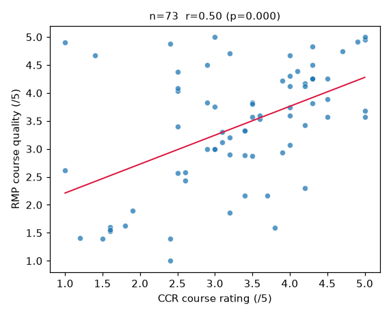
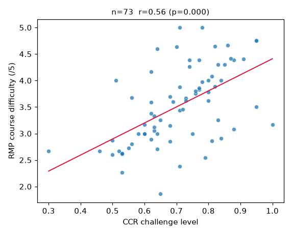
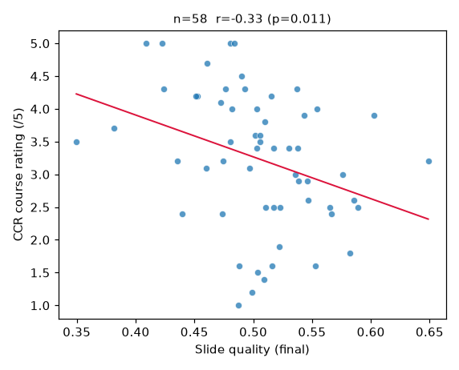
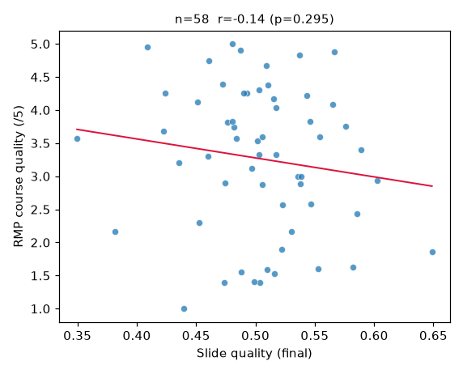

# CCR vs RMP correlation analysis

Courses: **73** rated70 courses. CCR ratings present: 73/73; RMP quality present: 73/73; slide score present: 58/73.

Each cell reports pairwise-complete `n`, Pearson `r` (linear) and Spearman `rho` (rank/monotonic) with p-values. Significance: `*` p<0.05, `**` p<0.01, `***` p<0.001.

## Primary: CCR course rating vs RMP professor quality

| x | y | n | Pearson r | p | Spearman rho | p |
|---|---|---|---|---|---|---|
| CCR course rating (/5) | RMP course quality (/5) | 73 | 0.496*** | 0.000 | 0.469*** | 0.000 |
| CCR course rating (/5) | RMP professor overall quality (/5) | 73 | 0.408*** | 0.000 | 0.361** | 0.002 |
| CCR course rating (/5) | RMP would-take-again % | 73 | 0.353** | 0.002 | 0.340** | 0.003 |
| CCR recommendation rate | RMP course quality (/5) | 73 | 0.293* | 0.012 | 0.265* | 0.023 |

## Difficulty / workload alignment

| x | y | n | Pearson r | p | Spearman rho | p |
|---|---|---|---|---|---|---|
| CCR challenge level | RMP course difficulty (/5) | 73 | 0.556*** | 0.000 | 0.588*** | 0.000 |
| CCR time investment | RMP course difficulty (/5) | 73 | 0.596*** | 0.000 | 0.604*** | 0.000 |
| CCR challenge level | RMP course quality (/5) | 73 | -0.312** | 0.007 | -0.282* | 0.016 |

## CCR sub-metrics vs RMP course quality

| x | y | n | Pearson r | p | Spearman rho | p |
|---|---|---|---|---|---|---|
| CCR student satisfaction | RMP course quality (/5) | 73 | 0.496*** | 0.000 | 0.465*** | 0.000 |
| CCR grade accessibility | RMP course quality (/5) | 73 | 0.049 | 0.679 | 0.112 | 0.346 |
| CCR time investment | RMP course quality (/5) | 73 | -0.392*** | 0.001 | -0.342** | 0.003 |
| CCR attendance importance | RMP course quality (/5) | 73 | 0.065 | 0.583 | 0.102 | 0.392 |

## Slide quality vs CCR and RMP

| x | y | n | Pearson r | p | Spearman rho | p |
|---|---|---|---|---|---|---|
| Slide quality (final) | CCR course rating (/5) | 58 | -0.332* | 0.011 | -0.396** | 0.002 |
| Slide quality (final) | RMP course quality (/5) | 58 | -0.140 | 0.295 | -0.149 | 0.264 |
| Slide quality (final) | CCR challenge level | 58 | 0.291* | 0.027 | 0.386** | 0.003 |
| Slide quality (final) | RMP course difficulty (/5) | 58 | 0.019 | 0.886 | 0.056 | 0.677 |
| Slide layer-1 score | RMP course quality (/5) | 58 | -0.086 | 0.522 | -0.067 | 0.617 |
| Slide layer-2 score | RMP course quality (/5) | 58 | -0.125 | 0.351 | -0.158 | 0.237 |

## Reading

- **Primary result:** CCR course rating vs RMP course quality shows a moderate positive correlation (Pearson r=0.496, p=0.000, Spearman rho=0.469, n=73) — statistically significant at alpha=0.05.
- CCR rates the *course*; RMP rates the *professor*. A positive link means courses students rate highly also tend to have highly-rated instructors.
- Difficulty measures (CCR challenge level / time investment vs RMP difficulty) are reported separately above.
- Slide-quality (RateMySlides) correlations use the 58 courses that were scored.

### Caveats
- n is modest (73 courses; fewer for slide pairs), so only moderate+ effects reach significance.
- CCR and RMP aggregate different student populations and time windows.
- Correlation is not causation.

## Scatter plots

